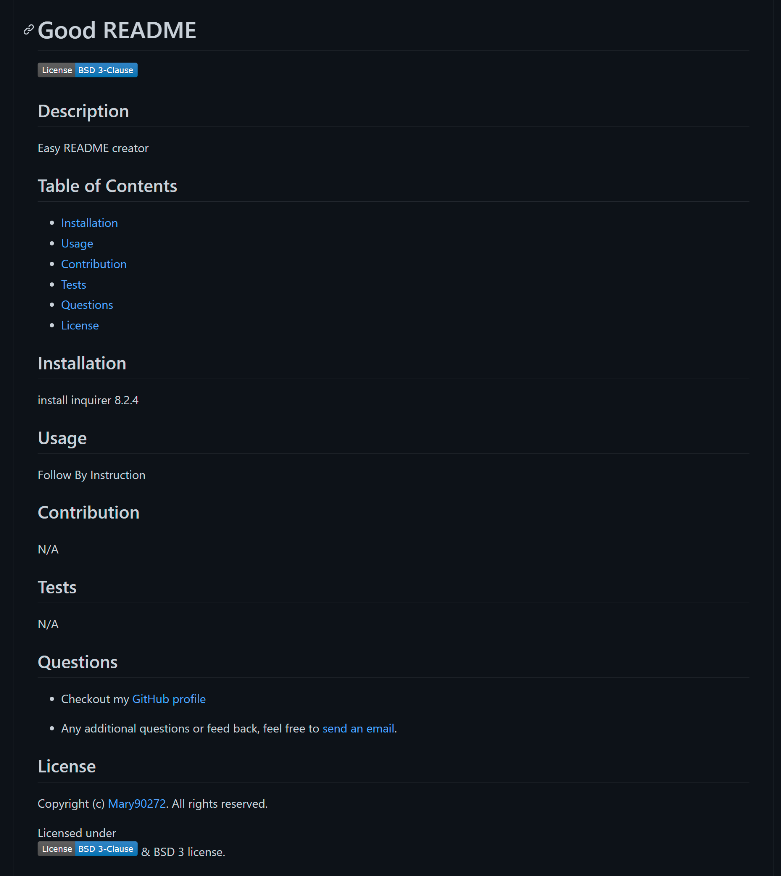

# Professional-README-Generator
A command-line application that dynamically generates a professionald README.md file from a user's input.
This is a A node.js application that uses user input from inquirer to populate a README.md file for user repository. It will help a user crate the README structure without having to worry about applying proper mark down syntax. the user is walked through a set of questions that requires their input including Description, Installation, Usage, Contributing, and Tests. The user is also presented with the license options which they can choose from four of the most popular open-source licenses. After choosing a license a the respective license badge will be at the top and botton of the README and a license section with text stating what license was chosen will be created. Lastly, user can input their email and github link which will appears in the questions section. After complete all the prompts, the README will generated with a message saying : Your README.md file has been generated in the assets folder. 
# Installation
 1.open terminal 
 2.clone the repository 
 3.cd into new directory (Must be in directory to work) 
 4.Initiate the npm by entering npm init 
 5.Download Inquirer package by entering npm install inquirer@8.2.4 
 6.Enter node index.js 
 
# Preview 
## Images README 
 
 
 ## Video showing the functionality of the application

 